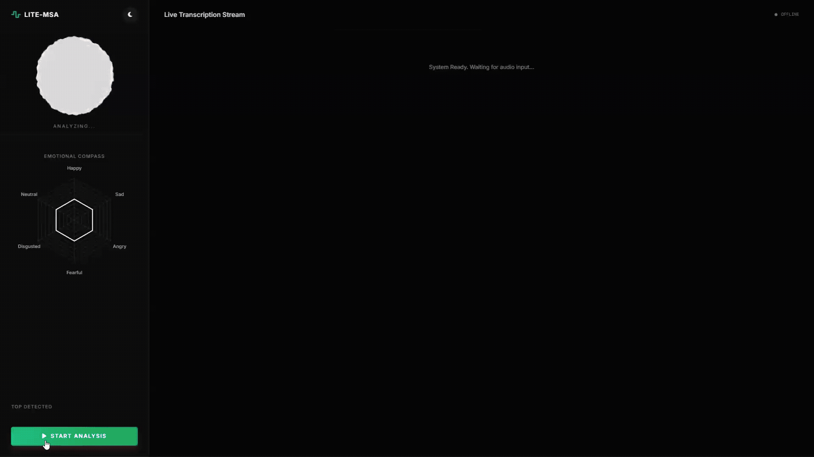
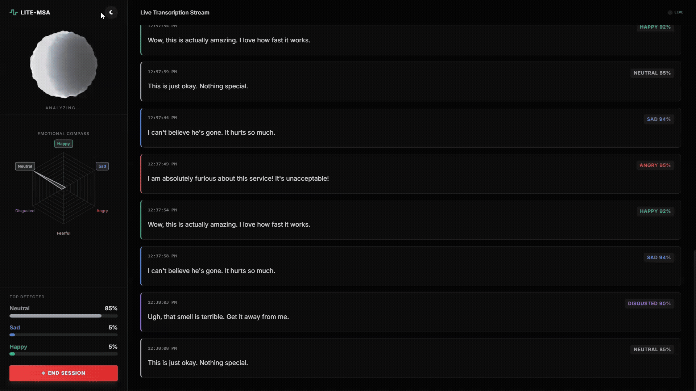

# Yayo-MSA-Stream

> **Real-Time Multimodal Sentiment Analysis on CPU**
>
> *Maintained by IanJ332*

[](https://opensource.org/licenses/MIT)
[](https://www.python.org/downloads/)
[](https://www.docker.com/)
[]()

**Yayo-MSA-Stream** is not just another sentiment analysis model; it's an engineering answer to a difficult question: *How do we bring state-of-the-art, multimodal emotion AI to standard hardware?*

This project implements a high-performance, asynchronous streaming architecture that fuses **Acoustic Features (Tone)** and **Linguistic Content (Text)** in real-time. It runs efficiently on consumer CPUs, making advanced emotion AI accessible for edge devices, cost-effective cloud deployments (like Cloud Run), and local applications.

---

## ⚡ The "Wow" Factor

### 1. Instant Analysis
Imagine a system that knows you're angry not just because you said "I hate this," but because your voice *trembled* with rage.


### 2. Simple Interaction
One click to start. No complex setup required for the end user.



### 3. Modern UI
Features a sleek, responsive design with Dark/Light mode support.



---

## 🚀 Key Features

*   **The "Ears" (Acoustic Pipeline)**:
    *   **Silero VAD (ONNX)** acts as a strict **gatekeeper**, filtering silence with <1ms latency to save compute.
    *   Uses a robust **Ensemble of HuBERT (Phonetics) and Wav2Vec2 (Robustness)** to capture subtle tonal nuances.
    *   Classifies tone using a custom **FusionNet** (2048-dim input) for high-fidelity emotion detection.
*   **The "Brain" (Text Pipeline)**:
    *   Transcribes speech using **Faster-Whisper (Int8)** for speed.
    *   Analyzes semantic sentiment with **DistilRoberta (ONNX)**, capturing implicit emotions like sarcasm.
*   **The Speed**:
    *   Fully optimized for CPU inference using **ONNX Runtime** and **Int8 Quantization** (Text Pipeline).
    *   Asynchronous **FastAPI + WebSockets** architecture handles streams without blocking.
*   **The Fusion**:
    *   Smart **Late Fusion** logic combines acoustic and text probabilities.
    *   **Real-world Example**: Handles "Smiling Voice" (Happy tone, Sad text) by weighing acoustic confidence against semantic meaning.

---

## 🏗️ Architecture


The system follows a "Monolithic Microservice" pattern to minimize network overhead. Audio flows in via WebSockets, is split into parallel processing queues, and results are fused at the decision layer.

### Performance Metrics (CPU)

| Metric | Value | Notes |
| :--- | :--- | :--- |
| **VAD Latency** | **< 5 ms** | Gatekeeper (ONNX) |
| **Acoustic Accuracy** | **High** | Dual-Backbone Ensemble |
| **Text Inference** | **~ 30 ms** | DistilBERT ONNX |
| **End-to-End Latency** | **< 800 ms** | Dependent on chunk size |

*Note: The current Acoustic Pipeline prioritizes accuracy (Ensemble) over raw speed. Future updates will introduce a distilled "Lite" acoustic mode.*

---

## 🛠️ Quick Start

### Option A: Docker (Recommended)

Get up and running in minutes without worrying about dependencies.

1.  **Build**:
    ```bash
    docker build -t yayo-msa-stream .
    ```
2.  **Run**:
    ```bash
    docker run -p 8000:8000 yayo-msa-stream
    ```
3.  **Experience**: Open `http://localhost:8000` and start speaking!

### Option B: Manual Setup

1.  **Environment**:
    ```bash
    python -m venv venv
    source venv/bin/activate  # or .\venv\Scripts\activate on Windows
    pip install -r requirements.txt
    ```
2.  **Run**:
    ```bash
    uvicorn app.main:app --reload
    ```

---

## 📚 Deep Dive

Want to understand the math behind the magic? Check out our detailed technical reports:

*   **[Technical Blueprint (English)](docs/lite.md)**: A comprehensive guide to the system's architecture, data flow, and optimization strategies.
*   **[Technical Report](docs/technical_report.md)**: Detailed analysis of model training, domain generalization (RAVDESS vs CREMA-D), and accuracy findings.

---

## 🔮 Roadmap

*   [ ] **Acoustic Distillation**: Quantizing the HuBERT/Wav2Vec2 ensemble for faster CPU inference.
*   [ ] **Edge Deployment**: Optimization for **Raspberry Pi / Jetson Nano** (IoT).
*   [ ] **Multilingual Support**: Expanding beyond English using multilingual Whisper models.

---

## Copyright

Copyright (c) 2025 **IanJ332**. All Rights Reserved.

Licensed under the [MIT License](LICENSE).
